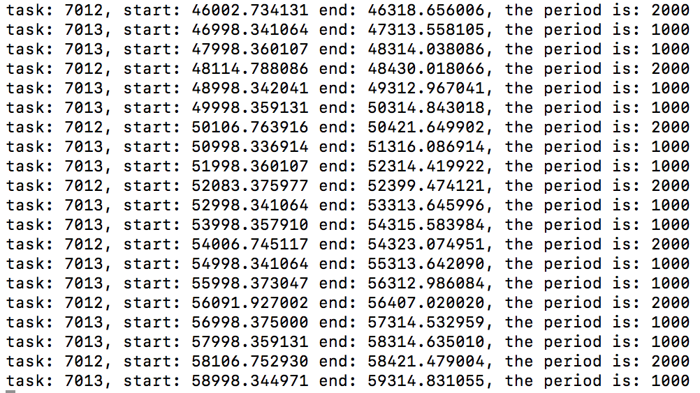

# CS423-MP1 by Boyin Zhang(bzhang70)

## Files

* `mp2.c` the core file containing all the methods for this MP.
* `userapp.c` the user application file, which is doing the factorial computation. And the input parameter for this file is `period`, `cpu time` and `iterations`.
* `Makefile` makefile of this MP, compile both `mp2.c` and `userapp.c`

## How to run the program

1. `make` to compile all the files and dependencies.
2. `sudo insmod BZHANG70_MP2.ko` install the module to kernel.
3. run `./userapp period1 cpu_time1 iterations1 & ./userapp period2 cpu_time2 iterations2` or more apps for multiple tasks.
4. `cat /proc/mp2/status` to check `PID:XX PERIOD:XX CPU_TIME:XX STATE:XX`.
5. After all the things done, by `sudo rmmod BZHANG70_MP2` to remove the module.
6. `make clean`.

## Implementation

1. `registration()` `de_registration()`: do registration and de-registration for tasks, they will only be called once, at the beginning of setting up the task and the time that we finish doing it. The registration part just copy the parameter for our own task structure and also add this task to our list. The de-registration part delete the task from the list.

2. `yielding()`: this function is called when a task finishes its computation or just come into the scheduler. It sets the task state to SLEEPING and sets the task’s timer next wake-up time. It also wakes up dispatcher to schedule a new task for running.

3. `dispatch_thread()`: core part of this project, try to find the highest priority task, if it is NULL, then we just preempt the currently running task, else we will preempt the current task with the task with the highest priority.

4. `admission_control()`: will prevent new process from getting into the scheduler if the CPU utilization is high, i.e. we cannot meet the deadlines after inserting this task.

## Degisning

For the designing decisions, I mostly follow the instruction of this MP, for example, using the ratio of 0.693 as the threshold for admission control. For software engineering stuffs, I wrote the helper functions that refactor the codes, like `get_task_by_pid()` which iterate the list to find the task, and `set_priority()` to set the priority for our tasks.

## Screenshot for 2 processes with 2000 period and 1000 period

After running `./userapp 2000 200 50 & ./userapp 1000 200 100`, we get the screenshot as following.

