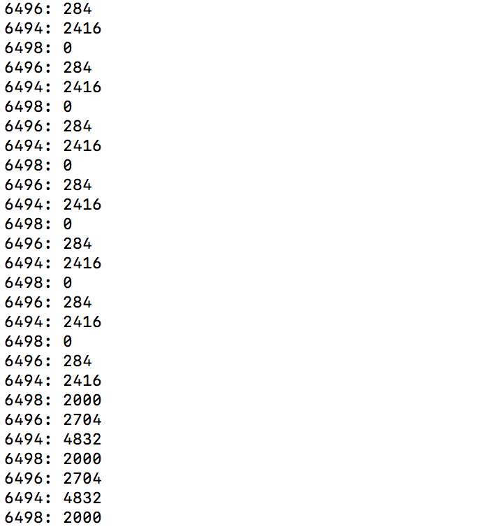

# CS423-MP1 by Boyin Zhang(bzhang70)

## Files

* `mp1.c` the core file containing all the methods for this MP.
* `userapp.c` the user application file, which register the process to kernel and run for 25 seconds.
* `Makefile` makefile of this MP, compile both `mp1.c` and `userapp.c`

## How to run the program

1. `make` to compile all the files and dependencies.
2. `sudo insmod BZHANG70_MP1.ko` install the module to kernel.
3. run multiple times `./userapp &` for multiple processes.
4. `cat /proc/mp1/status` to check `PID : CPU_TIME`.

## Screenshot for 3 processes

After running `cat /proc/BZHANG70_MP1/status`, we get the screenshot as following.

